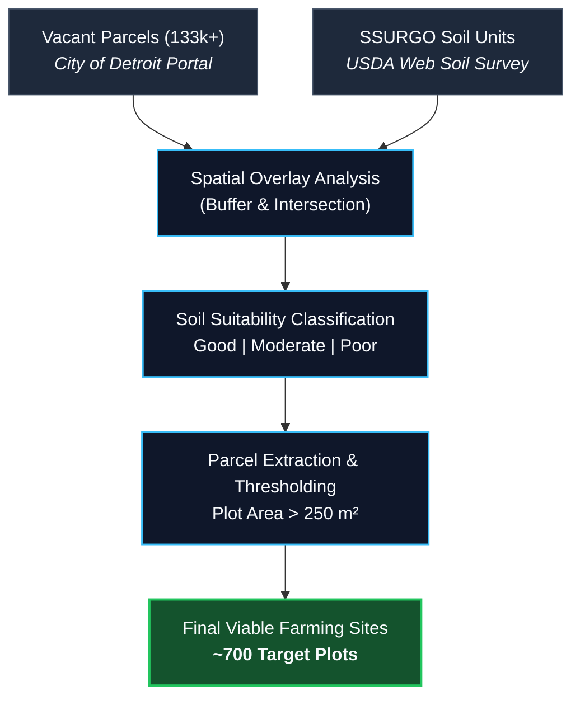

```mermaid
flowchart TD
    A["Vacant Parcels (133k+)<br><i>City of Detroit Portal</i>"] --> C["Spatial Overlay Analysis<br>(Buffer & Intersection)"]
    B["SSURGO Soil Units<br><i>USDA Web Soil Survey</i>"] --> C
    
    C --> D["Soil Suitability Classification<br>Good | Moderate | Poor"]
    D --> E["Parcel Extraction & Thresholding<br>Plot Area > 250 m²"]
    E --> F["Final Viable Farming Sites<br><b>~700 Target Plots</b>"]
    
    style A fill:#1e293b,stroke:#475569,stroke-width:1px,color:#f8fafc
    style B fill:#1e293b,stroke:#475569,stroke-width:1px,color:#f8fafc
    style C fill:#0f172a,stroke:#38bdf8,stroke-width:1.5px,color:#f8fafc
    style D fill:#0f172a,stroke:#38bdf8,stroke-width:1.5px,color:#f8fafc
    style E fill:#0f172a,stroke:#38bdf8,stroke-width:1.5px,color:#f8fafc
    style F fill:#14532d,stroke:#22c55e,stroke-width:2px,color:#f8fafc
```
